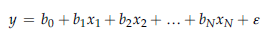
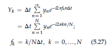

# Course Curriculum for Geological Modeling<a href="#Course-Curriculum-for-Geological-Modeling" class="anchor-link">¶</a>

### Fall 2022 - 01:460:418/16:460:611<a href="#Fall-2022---01:460:418/16:460:611" class="anchor-link">¶</a>

**Instructors:**

-   **W. John Schmelz**: <wjs107@eps.rutgers.edu>
-   **Professor Lauren Neitzke Adamo**: <Lneitzke@eps.rutgers.edu>

**Department of Earth and Planetary Sciences**  
Rutgers, The State University of New Jersey

# 1. Introduction to ArcGIS and spatial analysis<a href="#1.-Introduction-to-ArcGIS-and-spatial-analysis" class="anchor-link">¶</a>

Instructions for application here
(<https://raw.githubusercontent.com/wschmelz/GeologicalModeling/main/Documents/SpatialAnalysis.pdf>),
data and code available on request (1.5 GB).

## 1.1 ArcGIS - Importing data, setting symbology, creating and editing a shapefile, and making a map<a href="#1.1-ArcGIS---Importing-data,-setting-symbology,-creating-and-editing-a-shapefile,-and-making-a-map" class="anchor-link">¶</a>

## 1.2 Spatial analysis in ArcGIS applied to geomorphological map of Fire Island, NY<a href="#1.2-Spatial-analysis-in-ArcGIS-applied-to-geomorphological-map-of-Fire-Island,-NY" class="anchor-link">¶</a>

## 1.3 Programmatically quantify geomorphological change occuring due to Superstorm Sandy at Fire Island using geomorpholgical maps, lidar, and ArcPy<a href="#1.3-Programmatically-quantify-geomorphological-change-occuring-due-to-Superstorm-Sandy-at-Fire-Island-using-geomorpholgical-maps,-lidar,-and-ArcPy" class="anchor-link">¶</a>

## 2. Photogrammetry with Pix4D<a href="#2.-Photogrammetry-with-Pix4D" class="anchor-link">¶</a>

Instructions for application here
(<https://raw.githubusercontent.com/wschmelz/GeologicalModeling/main/Documents/DronePhotogrammetry.pdf>).
Data for part 2 available on request (121 MB).

## 2.1 Measurement of dimensions of toy blocks from photogrammetric model created using cell phone photos<a href="#2.1-Measurement-of-dimensions-of-toy-blocks-from-photogrammetric-model-created-using-cell-phone-photos" class="anchor-link">¶</a>

Real image:

3D model:

## 2.2 Photogrammetric model of beach and dune in Monmouth Beach, NJ<a href="#2.2-Photogrammetric-model-of-beach-and-dune-in-Monmouth-Beach,-NJ" class="anchor-link">¶</a>

# 3. Python basics - data types, indexing, plotting<a href="#3.-Python-basics---data-types,-indexing,-plotting" class="anchor-link">¶</a>

## 3.1 Introduction to Python<a href="#3.1-Introduction-to-Python" class="anchor-link">¶</a>

This is the first class we will learn to apply Python. In applying the
variety of computational methods we will learn in this course, try to
keep in mind that we are largely a group of earth scientists with
expertise in that domain. I.e., we arent and dont have to be computer
scientists, mathematicians, or statisticians. However, in familiarizing
ourselves with data analysis methods, hopefully we can apply
computational and statistical techniques in conjuction with our subject
matter knowledge to help advance our research and better prepare us to
evaluate and understand results produced within the earth science
community considering the application of these computational methods is
becoming more and more common.

In this class, we will use Python to make calculations and
store/visualize the results. Python is a "higher-level" programming
language. This simply means that the "lower-level" tasks, that concern
directly communicating processes to the hardware we are working with,
are integrated into the Python program. As a result, we can type natural
language commands that initiate computations. For example, we can set a
variable name, assign it a value, and print it using the lines of code
in the cell below.

In \[67\]:

    a = "YOUR_FIRST_NAME"
    print (a)

    YOUR_FIRST_NAME

There are certain rules associated with each command that instruct the
Python interpreter to produce an output. For example, the "print"
function allows us to create an output that catenates multiple input
values.

In \[68\]:

    b = "YOUR_LAST_NAME"
    print (a,b)

    YOUR_FIRST_NAME YOUR_LAST_NAME

The two variables, "a" and "b", are "objects" in Python. Objects are
scalar or non-scalar, and each object is characterized by a specific
data type. Variables "a" and "b" are comprised of a series of letters of
text, and they are assigned a "string" data type. We can request the
data type of any variable:

In \[69\]:

    print(type(a))
    print(type(b))

    <class 'str'>
    <class 'str'>

Strings are a non-scalar object. That simply means that they have an
internal structure that can be indexed or segregated. Lists are a second
type of non-scalar object. We can create a list, "c", from variables "a"
and "b".

In \[70\]:

    c = [a,b]
    print(c)

    ['YOUR_FIRST_NAME', 'YOUR_LAST_NAME']

The list "c", and the strings that comprise it can be subdivided using
an index that is specified within brackets. The first item in a
nonscalar object, whether it is a list item or a letter in a string, is
referenced using the index value "0". The nth item by integer n-1. A
series of items can be called using a colon, e.g., c\[0:n\] calls the
first n items in object "c."

In \[71\]:

    print('index of "YOUR_FIRST_NAME":',c.index('YOUR_FIRST_NAME'))
    print('item 1 in list "c":',c[0])
    print('first letter in item 1 in list "c":',c[0][0])
    print('index of "YOUR_LAST_NAME":',c.index('YOUR_LAST_NAME'))
    print('item 2 in list "c":',c[1])
    print('first four letters in item 2 in list "c":',c[1][0:4])

    index of "YOUR_FIRST_NAME": 0
    item 1 in list "c": YOUR_FIRST_NAME
    first letter in item 1 in list "c": Y
    index of "YOUR_LAST_NAME": 1
    item 2 in list "c": YOUR_LAST_NAME
    first four letters in item 2 in list "c": YOUR

So far, we have dealt exclusively with non-scalar objects. The scalar
objects are indivisible, in the sense that the objects themselves
cannont be subdivided. There are four types of scalar objects including
two types of numbers, integers and floating point numbers. The other
scalar data types are 'bool' and 'None'. Bolean values refer to "True"
or "False", and 'none' is an item with no value at all, which is a value
in itself and the only value in the 'none' data type.

Integers are represented by the 'int' data type. Floating point numbers,
that comprise the data type 'float', are real numbers and are always
represented with a decimal point in Python. Integers can be added,
subtracted, multiplied, or divided by other integers and can maintain an
integer data type, but will convert to a 'float' when an operation is
applied with both integers and floating point numbers.

In \[72\]:

    #data type of numbers
    d = 3
    e = 4
    f = 4.

    print(e,type(e))
    print(f,type(f))

    4 <class 'int'>
    4.0 <class 'float'>

In \[73\]:

    #data type of output of multiplication expressions
    g = d*e
    h = d*f

    print(d,"*",e,"=",g,type(g))
    print(d,"*",f,"=",h,type(h))

    3 * 4 = 12 <class 'int'>
    3 * 4.0 = 12.0 <class 'float'>

In \[74\]:

    #data type of output of division expressions
    i = g//d
    j = g/d
    k = e//d
    l = e/d

    print(g,"//",d,"=",i,type(i))
    print(g,"/",d,"=",j,type(j))

    print(e,"//",d,"=",k,type(k))
    print(e,"/",d,"=",l,type(l))

    #note the division of the integers either gives a float if using the '/' operator and the integer 
    #with no remainder using the "//" operator. use "%" to obtain the remainder of the calculation
    m = e%d
    print(e,"%",d,"=",m,type(m))

    12 // 3 = 4 <class 'int'>
    12 / 3 = 4.0 <class 'float'>
    4 // 3 = 1 <class 'int'>
    4 / 3 = 1.3333333333333333 <class 'float'>
    4 % 3 = 1 <class 'int'>

In \[75\]:

    #order of operations is maintained

    n = d+f*d
    o = (d+f)*d
    print (n)
    print (o)

    15.0
    21.0

We can make non-scalar objects, like a list, out of a series of scalar
objects. Or a list of a mix of data types.

In \[76\]:

    p = [a,c,d,f]
    print (p)
    print (type(p[0]))
    print (type(p[1]))
    print (type(p[2]))
    print (type(p[3]))

    ['YOUR_FIRST_NAME', ['YOUR_FIRST_NAME', 'YOUR_LAST_NAME'], 3, 4.0]
    <class 'str'>
    <class 'list'>
    <class 'int'>
    <class 'float'>

We can test whether a statement is true using the boolean data type.

In \[77\]:

    r = e==f
    s = type(e)==type(f)

    print(r)
    print(s)

    True
    False

And a variable with no value carries the 'none' data type.

In \[78\]:

    t = None
    print (type(t))

    <class 'NoneType'>

These concepts lead toward the formulation of simple programs or
algorithms. An algorithm to derive the square root of a number can be
derived. There are a couple of options for iteration in Python, and one
is the "while" function. It tests whether a statement is true, i.e.,
returns a Boolean value of True and will continue to iterate as long as
that is the case.

In \[79\]:

    u = 20. #test value
    v = 5. #initial value

    while abs(u - v * v) > .01:
        v = (v + u/v)/2
        
    print ("square root of",u,"is",v)
    print (v**2.)

    square root of 20.0 is 4.472222222222222
    20.000771604938272

We could also use a for loop with a specific number of iterations

In \[80\]:

    u = 20. #test value
    v = 5. #initial value
    i_2 = 10 #iterations

    for index in range(0,i_2):
        v = (v + u/v)/2

    print (v)
    print (v**2.)

    4.47213595499958
    20.000000000000004

## 3.2 Working with data in Python - plotting, indexing, interpolation<a href="#3.2-Working-with-data-in-Python---plotting,-indexing,-interpolation" class="anchor-link">¶</a>

### 3.2.1 Reading, writing, and indexing datafiles<a href="#3.2.1-Reading,-writing,-and-indexing-datafiles" class="anchor-link">¶</a>

#### 3.2.1.1 Create data and save as a text datafile<a href="#3.2.1.1-Create-data-and-save-as-a-text-datafile" class="anchor-link">¶</a>

In \[81\]:

    import numpy

    #create data x and y

    x = numpy.random.uniform(0,100,50)
    y = 0.25 * x + 10*numpy.sin(2.*numpy.pi*x/25)

    #create a 2D "array" to save data in 
    #see https://numpy.org/doc/stable/reference/generated/numpy.zeros.html

    output = numpy.zeros((len(x),2))

    #place x data into column 1 of the new matrix
    output[:,0] = x

    #place y data into column 2 of the new matrix
    output[:,1] = y

    #save as a text file
    #fmt specifies that data values are float type and have 3 decimal places
    #https://numpy.org/doc/stable/reference/generated/numpy.savetxt.html

    filename = "sine_curve.txt"
    numpy.savetxt(filename, output, fmt='%0.3f', delimiter=',')

#### 3.3.1.2 Read text datafile and index data<a href="#3.3.1.2-Read-text-datafile-and-index-data" class="anchor-link">¶</a>

This code uses a data file similar to the one created and saved as a
text file in section 3.1. Here it is downloaded from Github so this code
can run independently from other cells in this notebook. The script here
can be applied to read any text file you have saved in your local
directory.

In \[82\]:

    import matplotlib.pyplot as plt
    import numpy
    import requests

    #Download datafile and save to local directory as 'sine_curve.txt'
    url = 'https://raw.githubusercontent.com/wschmelz/GeologicalModeling/main/Data/Nonuniform_sine.txt'
    sine_curve = requests.get(url)  

    with open('sine_curve.txt', 'w') as f:
        f.write(sine_curve.text)

    #read datafile, set comma as the delimiter
    filename = "sine_curve.txt"
    data = numpy.genfromtxt(filename,delimiter=',')
        
    #make first data column the x values
    x = data[:,0]

    #make first data column the y values
    y = data[:,1]

    #create a figure, 9 inches by 9 inches
    fig = plt.figure(1,figsize=(9,3))

    #create a subplot and plot the x and y data 
    ax1 = plt.subplot(1,1,1)
    ax1.plot(x,y,marker="x",linewidth=0,color="k")

    ax1.grid()
    plt.show()

#### 3.3.1.3 Index data (cont.)<a href="#3.3.1.3-Index-data-(cont.)" class="anchor-link">¶</a>

Determine the shape of an array. Count the number of elements in an
array.

*This code uses a data file similar to the one created and saved as a
text file in section 3.1. It is downloaded from Github so this code can
run independently from other cells in this notebook.*

In \[83\]:

    import matplotlib.pyplot as plt
    import numpy
    import requests

    #Download datafile and save to local directory as 'sine_curve.txt'

    url = 'https://raw.githubusercontent.com/wschmelz/GeologicalModeling/main/Data/Nonuniform_sine.txt'
    sine_curve = requests.get(url)  

    with open('sine_curve.txt', 'w') as f:
        f.write(sine_curve.text)

    #read datafile, set comma as the delimiter

    filename = "sine_curve.txt"
    data = numpy.genfromtxt(filename,delimiter=',')

    #determine shape of data array
    print("Shape of array:")
    print (numpy.shape(data))

    #determine length of a 1-dimensional array, i.e., column 1 of the data file
    #this determine the number of values in a vector
    print("Length of vector:")
    print (len(data[:,0]))

    Shape of array:
    (50, 2)
    Length of vector:
    50

#### 3.3.1.4 Index data (cont.)<a href="#3.3.1.4-Index-data-(cont.)" class="anchor-link">¶</a>

Find where dataset meets specified criteria. Here, where x values are
**greater than 20 and less than 80**.

*This code uses a data file similar to the one created and saved as a
text file in section 3.1. It is downloaded from Github so this code can
run independently from other cells in this notebook.*

In \[84\]:

    import matplotlib.pyplot as plt
    import numpy
    import requests

    #Download datafile and save to local directory as 'sine_curve.txt'

    url = 'https://raw.githubusercontent.com/wschmelz/GeologicalModeling/main/Data/Nonuniform_sine.txt'
    sine_curve = requests.get(url)  

    with open('sine_curve.txt', 'w') as f:
        f.write(sine_curve.text)

    #read datafile, set comma as the delimiter

    filename = "sine_curve.txt"
    data = numpy.genfromtxt(filename,delimiter=',')

    #find where values in column 1 are greater than 20 and less than 80

    w1 = numpy.where((data[:,0]>20)&(data[:,0]<80))[0]

    # print the number of values where this condtion is true
    print("Number of values greater than 20 and less than 80:")
    print(len(w1))

    #create a figure, 9 inches by 9 inches
    fig = plt.figure(1,figsize=(9,3))

    #create a subplot
    ax1 = plt.subplot(1,1,1)

    #plot the original x,y data
    ax1.plot(data[:,0],data[:,1],marker="x",linewidth=0,color="k",label = "original")

    #plot the indexed x,y data, with x values between 20 and 80
    ax1.plot(data[w1,0],data[w1,1],marker="x",linewidth=0,color="r",label = "indexed")

    ax1.legend()
    ax1.grid()
    plt.show()

    Number of values greater than 20 and less than 80:
    27

### 3.3.1.5 Index data (cont.)<a href="#3.3.1.5-Index-data-(cont.)" class="anchor-link">¶</a>

Find where dataset meets specified criteria. Here, where x values are
**less than 20 or greater than 80**.

*This code uses a data file similar to the one created and saved as a
text file in the previous cell. It is downloaded from Github so this
code can run independently from other cells in this notebook.*

In \[85\]:

    import matplotlib.pyplot as plt
    import numpy
    import requests

    #Download datafile and save to local directory as 'sine_curve.txt'

    url = 'https://raw.githubusercontent.com/wschmelz/GeologicalModeling/main/Data/Nonuniform_sine.txt'
    sine_curve = requests.get(url)  

    with open('sine_curve.txt', 'w') as f:
        f.write(sine_curve.text)

    #read datafile, set comma as the delimiter

    filename = "sine_curve.txt"
    data = numpy.genfromtxt(filename,delimiter=',')

    #find where values in column 1 are greater than 20 and less than 80

    w1 = numpy.where((data[:,0]<20) | (data[:,0]>80))[0]

    # print the number of values where this condtion is true
    print("Number of values less than 20 or greater than 80:")
    print(len(w1))

    #create a figure, 9 inches by 9 inches
    fig = plt.figure(1,figsize=(9,3))

    #create a subplot
    ax1 = plt.subplot(1,1,1)

    #plot the original x,y data
    ax1.plot(data[:,0],data[:,1],marker="x",linewidth=0,color="k",label = "original")

    #plot the indexed x,y data, with x values between 20 and 80
    ax1.plot(data[w1,0],data[w1,1],marker="x",linewidth=0,color="r",label = "indexed")

    ax1.legend()
    ax1.grid()
    plt.show()

    Number of values less than 20 or greater than 80:
    23

### 3.2.2 Plotting data<a href="#3.2.2-Plotting-data" class="anchor-link">¶</a>

#### 3.2.2.1 Create subplots<a href="#3.2.2.1-Create-subplots" class="anchor-link">¶</a>

In \[86\]:

    import matplotlib.pyplot as plt
    import numpy

    #create data x and y1, y2, and y3

    x = numpy.arange(0,50,1)
    y1 = (x * 0.5)
    y2 = (x * 0.5) + numpy.random.normal(0,1,len(x))
    y3 = (x * 0.5) + numpy.random.normal(0,5,len(x))

    #create a figure, 9 inches by 9 inches
    fig = plt.figure(1,figsize=(9,9))

    #create top subplot and plot y1
    ax1 = plt.subplot(3,1,1)
    ax1.plot(x,y1,marker="x",linewidth=0,color="k")
    ax1.grid()

    #create middle subplot and plot y2
    ax2 = plt.subplot(3,1,2)
    ax2.plot(x,y2,marker="x",linewidth=0,color="k")
    ax2.grid()

    #create lower subplot and plot y3
    ax3 = plt.subplot(3,1,3)
    ax3.plot(x,y3,marker="x",linewidth=0,color="k")
    ax3.grid()

    plt.show()

#### 3.2.2.2 Plot data with mathematical expressions in labels<a href="#3.2.2.2-Plot-data-with-mathematical-expressions-in-labels" class="anchor-link">¶</a>

In \[87\]:

    import matplotlib.pyplot as plt
    import numpy
    import requests

    #Download LR04 d18O stack datafile and save to local directory

    url = 'https://raw.githubusercontent.com/wschmelz/GeologicalModeling/main/Data/d18O/00_LR04.csv'
    LR04 = requests.get(url)  

    with open('00_LR04.csv', 'w') as f:
        f.write(LR04.text)

    #read datafile, set comma as the delimiter

    filename = '00_LR04.csv'
    LR04 = numpy.genfromtxt(filename,delimiter=',')

    #Download datafile with all the LR04 d18O data and save to local directory

    url = 'https://raw.githubusercontent.com/wschmelz/GeologicalModeling/main/Data/d18O/01_LR_original_data.csv'
    LR_original_data = requests.get(url)  

    with open('01_LR_original_data.csv', 'w') as f:
        f.write(LR_original_data.text)

    #read datafile, set comma as the delimiter

    filename = "01_LR_original_data.csv"
    LR04_orig = numpy.genfromtxt(filename,delimiter=',')

    #Download datafile with the d18O data from ODP leg 138 site 846 and save to local directory

    url = 'https://raw.githubusercontent.com/wschmelz/GeologicalModeling/main/Data/d18O/02_ODP_138_846_d18O.csv'
    ODP_138_846_d18O = requests.get(url)  

    with open('02_ODP_138_846_d18O.csv', 'w') as f:
        f.write(ODP_138_846_d18O.text)

    #read datafile, set comma as the delimiter

    filename = "02_ODP_138_846_d18O.csv"
    ODP_138_846 = numpy.genfromtxt(filename,delimiter=',')

    #plot data

    fig = plt.figure(1,figsize=(9,9))

    ax1 = plt.subplot(131)
    ax1.plot(LR04[:,1],LR04[:,0],color="k")

    ax1.set_ylim(800,0)
    ax1.set_xlim(2.75,5.25)
    ax1.grid()
    ax1.set_title("LR04 stack")
    ax1.set_ylabel("Age (ka)")
    ax1.set_xlabel("benthic $\delta^{18}O$")

    ax2 = plt.subplot(132)
    ax2.plot(LR04_orig[:,1],LR04_orig[:,0],linewidth=0.0,marker='x',color="gray")

    ax2.set_ylim(800,0)
    ax2.set_xlim(2.75,5.25)
    ax2.grid()
    ax2.set_title("LR04 data")
    ax2.set_yticklabels([])
    ax2.set_xlabel("benthic $\delta^{18}O$")

    ax3 = plt.subplot(133)
    ax3.plot(ODP_138_846[:,1],ODP_138_846[:,0],linewidth=0.0,marker='x',color="dodgerblue")

    ax3.set_ylim(800,0)
    ax3.set_xlim(2.75,5.25)
    ax3.grid()
    ax3.set_title("Site 846")
    ax3.set_xlabel("benthic $\delta^{18}O$")              
    ax3.set_yticklabels([])

    plt.show()

## 3.2.3 Interpolate data<a href="#3.2.3-Interpolate-data" class="anchor-link">¶</a>

#### 3.2.3.1 Linear interpolation<a href="#3.2.3.1-Linear-interpolation" class="anchor-link">¶</a>

In \[88\]:

    import matplotlib.pyplot as plt
    import numpy
    import scipy
    from scipy import interpolate

    #create data x and y

    x = numpy.random.uniform(0,50,25)
    y = 10*numpy.sin(2.*numpy.pi*x/25)

    #interpolate data, x and y

    f = scipy.interpolate.interp1d(x, y)

    #create new evenly spaced x data points between the minimum value 
    #and the maximum value in vector x

    x_new = numpy.arange(numpy.min(x),numpy.max(x),1)

    #create new interpolated y data points 
    #at the locations of the new evenly spaced x data points

    y_new = f(x_new)

    #create a figure, 9 inches by 9 inches
    fig = plt.figure(1,figsize=(9,3))

    #create a subplot. plot the original x and y data 
    #and the new x and y data
    ax1 = plt.subplot(1,1,1)
    ax1.plot(x,y,marker="x",linewidth=0,color="k",label="original")
    ax1.plot(x_new,y_new,marker="x",linewidth=0,color="b",label="new")

    ax1.legend()
    ax1.grid()
    plt.show()

#### 3.2.3.2 Moving average interpolation<a href="#3.2.3.2-Moving-average-interpolation" class="anchor-link">¶</a>

The moving average function pulled for this script is available either
on Github
(<https://raw.githubusercontent.com/wschmelz/GeologicalModeling/main/Scripts/m_avg.py>)
or in the interpolation Jupyter Notebook we covered in week 4. Works
best with a densely populated dataset.

In \[89\]:

    import sys
    import matplotlib.pyplot as plt
    import numpy
    import requests

    ##dowloaad moving average algorithm as a python script from Github this is the same script
    #in the Jupyter Notebook we went over in week 4

    url = 'https://raw.githubusercontent.com/wschmelz/GeologicalModeling/main/Scripts/m_avg.py'
    m_avg_py = requests.get(url)  

    with open('m_avg_py.py', 'w') as f:
        f.write(m_avg_py.text)
        
    import m_avg_py

    #create data x and y

    x = numpy.random.uniform(0,50,400)
    y = 10*numpy.sin(2.*numpy.pi*x/25) + numpy.random.normal(0,1,len(x))

    #create new evenly spaced x data points between the minimum value 
    #and the maximum value in vector x

    x_new = numpy.arange(numpy.min(x),numpy.max(x),1)

    #interpolate data and create new interpolated y data points 
    #at the locations of the new evenly spaced x data points
    #using specified parameters m_avg(x_new,x_orig,y_orig,span)

    #set new x values
    x_new = x_new*1.0

    #set x values to interpolate
    x_orig = x*1.0

    #set y values to interpolate
    y_orig = y*1.0

    #set window length
    span = 2.

    y_new = m_avg_py.m_avg(x_new,x_orig,y_orig,span)

    #create a figure, 9 inches by 9 inches
    fig = plt.figure(1,figsize=(9,3))

    #create a subplot. plot the original x and y data 
    #and the new x and y data interpolated using moving average algorithm
    ax1 = plt.subplot(1,1,1)
    ax1.plot(x,y,marker="x",linewidth=0,color="k",label="original")
    ax1.plot(x_new,y_new,linewidth=2,color="b",label="new")

    ax1.legend()

    ax1.grid()
    plt.show()

#### 3.2.3.3 Spline interpolation<a href="#3.2.3.3-Spline-interpolation" class="anchor-link">¶</a>

In \[90\]:

    import sys
    import matplotlib.pyplot as plt
    import numpy
    import scipy
    from scipy import interpolate

    #create data x and y

    x = numpy.random.uniform(0,50,25)
    y = 10*numpy.sin(2.*numpy.pi*x/25)

    #create new evenly spaced x data points between the minimum value 
    #and the maximum value in vector x

    x_new = numpy.arange(numpy.min(x),numpy.max(x),1)

    #interpolate data and create new interpolated y data points 
    #at the locations of the new evenly spaced x data points
    #using specified parameters m_avg(x_new,x_orig,y_orig,span)

    #set new x values
    x_new = x_new*1.0

    #set x values to interpolate
    x_orig = x*1.0

    #set y values to interpolate
    y_orig = y*1.0

    f = scipy.interpolate.interp1d(x_orig,y_orig,'cubic')
    y_new = f(x_new)

    #create a figure, 9 inches by 9 inches
    fig = plt.figure(1,figsize=(9,3))

    #create a subplot. plot the original x and y data 
    #and the new x and y data interpolated using spline

    ax1 = plt.subplot(1,1,1)
    ax1.plot(x,y,marker="x",linewidth=0,color="k",label="original")
    ax1.plot(x_new,y_new,marker="x",linewidth=0,color="b",label="new")

    ax1.legend()

    ax1.grid()
    plt.show()

#### 3.2.3.4 Inverse distance weighted (IDW) interpolation<a href="#3.2.3.4-Inverse-distance-weighted-(IDW)-interpolation" class="anchor-link">¶</a>

The IDW function pulled for this script is available either on Github
(<https://raw.githubusercontent.com/wschmelz/GeologicalModeling/main/Scripts/IDW.py>)
or in the interpolation Jupyter Notebook we covered in week 4. Works
best with a densely populated dataset.

In \[91\]:

    import sys
    import matplotlib.pyplot as plt
    import numpy
    import requests

    ##dowloaad IDW algorithm as a python script from Github this is the same script
    #in the Jupyter Notebook we went over in week 4

    url = 'https://raw.githubusercontent.com/wschmelz/GeologicalModeling/main/Scripts/IDW.py'
    IDW_py = requests.get(url)  

    with open('IDW_py.py', 'w') as f:
        f.write(IDW_py.text)
        
    import IDW_py

    #create data x and y

    x = numpy.random.uniform(0,50,400)
    y = 10*numpy.sin(2.*numpy.pi*x/25) + numpy.random.normal(0,1,len(x))

    #create new evenly spaced x data points between the minimum value 
    #and the maximum value in vector x

    x_new = numpy.arange(numpy.min(x),numpy.max(x),1)

    #interpolate data and create new interpolated y data points 
    #at the locations of the new evenly spaced x data points
    #using specified parameters IDW(x_new,x_orig,y_orig,span,factor)

    #set new x values
    x_new = x_new*1.0

    #set x values to interpolate
    x_orig = x*1.0

    #set y values to interpolate
    y_orig = y*1.0

    #set window length
    span = 2.5

    #set factor
    factor = 2.

    y_new = IDW_py.IDW(x_new,x_orig,y_orig,span,factor)

    #create a figure, 9 inches by 9 inches
    fig = plt.figure(1,figsize=(9,3))

    #create a subplot. plot the original x and y data 
    #and the new x and y data interpolated using moving average algorithm
    ax1 = plt.subplot(1,1,1)
    ax1.plot(x,y,marker="x",linewidth=0,color="k",label="original")
    ax1.plot(x_new,y_new,linewidth=2,color="b",label="new")

    ax1.legend()

    ax1.grid()
    plt.show()

#### 3.2.3.5 LOESS interpolation<a href="#3.2.3.5-LOESS-interpolation" class="anchor-link">¶</a>

##### 3.2.3.5.1 LOESS interpolation of sample dataset<a href="#3.2.3.5.1-LOESS-interpolation-of-sample-dataset" class="anchor-link">¶</a>

The loess function stored on Github and pulled for this script is
available either on Github
(<https://github.com/wschmelz/GeologicalModeling/blob/main/Scripts/loess.py>)
or in the interpolation Jupyter Notebook we covered in week 4.

In \[92\]:

    import sys
    import matplotlib.pyplot as plt
    import numpy
    import requests

    ##dowloaad LOESS algorithm as a python script from Github this is the same script
    #in the Jupyter Notebook we went over in week 4

    url = 'https://raw.githubusercontent.com/wschmelz/GeologicalModeling/main/Scripts/loess.py'
    loess_py = requests.get(url)  

    with open('loess_py.py', 'w') as f:
        f.write(loess_py.text)
        
    import loess_py

    #create data x and y

    x = numpy.random.uniform(0,50,25)
    y = 10*numpy.sin(2.*numpy.pi*x/25)

    #create new evenly spaced x data points between the minimum value 
    #and the maximum value in vector x

    x_new = numpy.arange(numpy.min(x),numpy.max(x),1)

    #interpolate data and create new interpolated y data points 
    #at the locations of the new evenly spaced x data points
    #using specified parameters loess(x_new,x,y,pt_min_r,dist_r,factor)

    #set new x values
    x_new = x_new*1.0

    #set x values to interpolate
    x = x*1.0

    #set y values to interpolate
    y = y*1.0

    #set minimum points to consider (must be integer)
    pt_min_r = 5

    #set window length
    dist_r = 5.

    #set factor of 1 (linear) or 2 (polynomial)
    factor = 2

    y_new = loess_py.loess(x_new,x,y,pt_min_r,dist_r,factor)

    #create a figure, 9 inches by 3 inches
    fig = plt.figure(1,figsize=(9,3))

    #create a subplot. plot the original x and y data 
    #and the new x and y data interpolated using loess algorithm
    ax1 = plt.subplot(1,1,1)
    ax1.plot(x,y,marker="x",linewidth=0,color="k",label="original")
    ax1.plot(x_new,y_new,marker="x",linewidth=0,color="b",label="new")

    ax1.legend()

    ax1.grid()
    plt.show()

    LOESS Regression complete                     

##### 3.2.3.5.2 LOESS interpolation of d18O data<a href="#3.2.3.5.2-LOESS-interpolation-of-d18O-data" class="anchor-link">¶</a>

The loess function stored on Github and pulled for this script is
available either on Github
(<https://github.com/wschmelz/GeologicalModeling/blob/main/Scripts/loess.py>)
or in the interpolation Jupyter Notebook we covered in week 4.

In \[93\]:

    import matplotlib.pyplot as plt
    import numpy
    import requests

    #Download LR04 d18O stack datafile and save to local directory

    url = 'https://raw.githubusercontent.com/wschmelz/GeologicalModeling/main/Data/d18O/00_LR04.csv'
    LR04 = requests.get(url)  

    with open('00_LR04.csv', 'w') as f:
        f.write(LR04.text)

    #read datafile, set comma as the delimiter

    filename = '00_LR04.csv'
    LR04 = numpy.genfromtxt(filename,delimiter=',')

    #Download datafile with all the LR04 d18O data and save to local directory

    url = 'https://raw.githubusercontent.com/wschmelz/GeologicalModeling/main/Data/d18O/01_LR_original_data.csv'
    LR_original_data = requests.get(url)  

    with open('01_LR_original_data.csv', 'w') as f:
        f.write(LR_original_data.text)

    #read datafile, set comma as the delimiter

    filename = "01_LR_original_data.csv"
    LR04_orig = numpy.genfromtxt(filename,delimiter=',')

    #Download datafile with the d18O data from ODP leg 138 site 846 and save to local directory

    url = 'https://raw.githubusercontent.com/wschmelz/GeologicalModeling/main/Data/d18O/02_ODP_138_846_d18O.csv'
    ODP_138_846_d18O = requests.get(url)  

    with open('02_ODP_138_846_d18O.csv', 'w') as f:
        f.write(ODP_138_846_d18O.text)

    #read datafile, set comma as the delimiter

    filename = "02_ODP_138_846_d18O.csv"
    ODP_138_846 = numpy.genfromtxt(filename,delimiter=',')

    ##dowloaad LOESS algorithm as a python script from Github this is the same script
    #in the Jupyter Notebook we went over in week 4

    url = 'https://raw.githubusercontent.com/wschmelz/GeologicalModeling/main/Scripts/loess.py'
    loess_py = requests.get(url)  

    with open('loess_py.py', 'w') as f:
        f.write(loess_py.text)
        
    import loess_py

    #create interpolation values
    dt = 1.
    time_start = 800.
    t_vals = numpy.arange(0,time_start+dt,dt)

    #set window length
    dist_r1 = 2.5
    dist_r2 = 20.
    #set factor
    pt_min_r = 10

    #apply function

    LOESS_LR04_orig = loess_py.loess(t_vals,LR04_orig[:,0],LR04_orig[:,1],pt_min_r,dist_r1,2)
    LOESS_Site846 = loess_py.loess(t_vals,ODP_138_846[:,0],ODP_138_846[:,1],pt_min_r,dist_r2,2)

    #replot

    fig = plt.figure(2,figsize=(9,9))

    ax1 = plt.subplot(131)
    ax1.plot(LR04[:,1],LR04[:,0],color="k")

    ax1.set_ylim(800,0)
    ax1.set_xlim(2.75,5.25)
    ax1.grid()
    ax1.set_title("LR04 stack")
    ax1.set_ylabel("Age (ka)")
    ax1.set_xlabel("benthic $\delta^{18}O$")

    ax2 = plt.subplot(132)
    ax2.plot(LR04_orig[:,1],LR04_orig[:,0],linewidth=0.0,marker='x',color="gray")
    ax2.plot(LOESS_LR04_orig,t_vals,linewidth=2.0,color="k")

    ax2.set_ylim(800,0)
    ax2.set_xlim(2.75,5.25)
    ax2.grid()
    ax2.set_title("LR04 data")
    ax2.set_yticklabels([])
    ax2.set_xlabel("benthic $\delta^{18}O$")

    ax3 = plt.subplot(133)
    ax3.plot(ODP_138_846[:,1],ODP_138_846[:,0],linewidth=0.0,marker='x',color="dodgerblue")
    ax3.plot(LOESS_Site846,t_vals,linewidth=2.0,color="blue")

    ax3.set_ylim(800,0)
    ax3.set_xlim(2.75,5.25)
    ax3.grid()
    ax3.set_title("Site 846")
    ax3.set_xlabel("benthic $\delta^{18}O$")              
    ax3.set_yticklabels([])

    plt.show()

    LOESS Regression complete                       
    LOESS Regression complete                       

##### 3.2.3.5.3 2D LOESS interpolation of drone topography<a href="#3.2.3.5.3-2D-LOESS-interpolation-of-drone-topography" class="anchor-link">¶</a>

The loess function stored on Github and pulled for this script is
available either on Github
(<https://github.com/wschmelz/GeologicalModeling/blob/main/Scripts/loess.py>)
or in the interpolation Jupyter Notebook we covered in week 4.

In \[94\]:

    import matplotlib.pyplot as plt
    import numpy
    import requests

    #Download drone topography datafile and save to local directory

    url = 'https://raw.githubusercontent.com/wschmelz/GeologicalModeling/main/Data/DroneTopo/MB_20220522_rpd.csv'
    MB_20220522_rpd = requests.get(url)  

    with open('MB_20220522_rpd.csv', 'w') as f:
        f.write(MB_20220522_rpd.text)

    ##dowloaad LOESS algorithm as a python script from Github this is the same script
    #in the Jupyter Notebook we went over in week 4

    url = 'https://raw.githubusercontent.com/wschmelz/GeologicalModeling/main/Scripts/loess.py'
    loess_py = requests.get(url)  

    with open('loess_py.py', 'w') as f:
        f.write(loess_py.text)
        
    import loess_py

    drone_datafile1 =  "MB_20220522_rpd.csv"
    drone_data1 = numpy.genfromtxt(drone_datafile1, delimiter = ",")

    #make new grid

    x_max = 587285.
    x_min = 587140.
    y_max = 4466350.
    y_min = 4466010.

    cellsize = 2.
    new_x = numpy.arange(x_min,x_max+cellsize,cellsize)
    new_y = numpy.arange(y_min,y_max+cellsize,cellsize)

    X, Y = numpy.meshgrid(new_x, new_y)

    print (numpy.shape(X))

    print ("Number of nterpolated data points: ", len(numpy.ndarray.flatten(X)))

    #interpolate data and create new interpolated y data points 
    #at the locations of the new evenly spaced x data points
    #using specified parameters loess2D(x_new,y_new,x,y,z,pt_min_r,dist_r,factor)

    #set new x values
    x_new = numpy.ndarray.flatten(X)*1.0

    #set new y values
    y_new = numpy.ndarray.flatten(Y)*1.0

    #set x values to interpolate
    x = drone_data1[::2,0]*1.0

    #set y values to interpolate
    y = drone_data1[::2,1]*1.0

    #set z values to interpolate
    z = drone_data1[::2,2]*1.0

    #set minimum points to consider (must be integer)
    pt_min_r = 10

    #set window length
    dist_r = 3.

    #set factor of 1 (linear) or 2 (polynomial)
    factor = 2

    Z1_loess = loess.loess_2D(x_new,y_new,x,y,z,pt_min_r,dist_r,factor)
    Z1_loess = numpy.reshape(Z1_loess,numpy.shape(X))

    #linear interpolation for comparison

    Z1 = interpolate.griddata(drone_data1[:,0:2], drone_data1[:,2], (X, Y), method='linear')

    #plot results

    fig = plt.figure(figsize=(10,12))

    ax1 = plt.subplot(121)

    ax1.pcolor(X,Y,Z1,cmap="gist_ncar",vmin=-32.5,vmax=-24.5,shading="auto")
    ax1.set_aspect("equal")
    ax1.set_title("2D linear")

    ax2 = plt.subplot(122)

    ax2.pcolor(X,Y,Z1_loess,cmap="gist_ncar",vmin=-32.5,vmax=-24.5,shading="auto")
    ax2.set_aspect("equal")
    ax2.set_title("2D LOESS")
    plt.tight_layout()
    plt.show()

    (74,)
    (171,)
    (171, 74)
    (171, 74)
    Number of nterpolated data points:  12654
    LOESS Regression complete                           

# 4. Summary statistics, regression, and correlation<a href="#4.-Summary-statistics,-regression,-and-correlation" class="anchor-link">¶</a>

## 4. Summary statistics<a href="#4.-Summary-statistics" class="anchor-link">¶</a>

In \[1\]:

    import numpy

    #take 100 samples from a normal distribution with a mean of 5 and stdev of 2
    # numpy.random.normal(mean,stdev,samples)

    x = numpy.random.normal(5,2,100)

    #calculate the number of data values in x (we set this to 100)

    N = len(x)
    print("N:",N)

    #calculate the mean 

    mean_x = numpy.mean(x)
    print("Sample mean:",round(mean_x,3))

    #calculate the standard deviation 

    std_x = numpy.std(x)
    print("Standard deviation:",round(std_x,3))

    #calculate the standard error on the estimate of the mean

    se_x = numpy.std(x)/numpy.sqrt(N)
    print("Standard error:",round(se_x,3))

    #95% Confidence intervals on the estimate of the mean

    high_975 = mean_x + (1.96*se_x)
    low_025 = mean_x - (1.96*se_x)

    print("The mean of x is", round(mean_x,3),"; 95% CI ranges from", round(low_025,3), "to", round(high_975,3))

    N: 100
    Sample mean: 4.927
    Standard deviation: 1.991
    Standard error: 0.199
    The mean of x is 4.927 ; 95% CI ranges from 4.537 to 5.317

## 5. Mapping earth surface processes<a href="#5.-Mapping-earth-surface-processes" class="anchor-link">¶</a>

### 5.1 Relative elevation model of the Skagit River<a href="#5.1-Relative-elevation-model-of-the-Skagit-River" class="anchor-link">¶</a>

Instructions for application here (), data and code available on request
(1.5 GB).

## 6. Correlation and regression<a href="#6.-Correlation-and-regression" class="anchor-link">¶</a>

### 6.1 Covariance and correlation<a href="#6.1-Covariance-and-correlation" class="anchor-link">¶</a>

In \[96\]:

    import matplotlib.pyplot as plt
    import numpy

    #define functions for covariance and correlation coefficient

    def cov(x1,x2):
        N = len(x1)
        mean_x1 = numpy.mean(x1)
        mean_x2 = numpy.mean(x2)
        cov_tmp = (1./(N-1)) * numpy.sum((x1-mean_x1)*(x2-mean_x2))
        return cov_tmp

    def corr_coeff(x1,x2):
        N = len(x1)
        mean_x1 = numpy.mean(x1)
        mean_x2 = numpy.mean(x2)
        stdev_x1 = numpy.std(x1)
        stdev_x2 = numpy.std(x2)
        cov_tmp = (1./(N-1)) * numpy.sum((x1-mean_x1)*(x2-mean_x2))
        r_tmp = cov_tmp/(stdev_x1*stdev_x2)
        return r_tmp

    #Create a correlated distribution of data with a covariance set to 0.75

    var_x1 = 2.
    var_x2 = 1.
    cov_x1_x2 = 0.75
    mean_x1 = 5.0
    mean_x2 = 0.0

    u = numpy.array([mean_x1,mean_x2])
    k = numpy.array([[var_x1, cov_x1_x2], [cov_x1_x2, var_x2]])
    dist = numpy.random.multivariate_normal(u, k, size=1000)
    x1, x2 = dist[:,0],dist[:,1]

    #calculate covariance and correlation coefficient ("r") using defined functions

    covariance = cov(x1,x2)
    r = corr_coeff(x1,x2)
    cov_mat = numpy.cov(x1,x2)

    print(r)
    print("Sample covariance:", round(covariance,3))
    print("Correlation coefficient (r):", round(r,3))
    print("Sample covariance matrix:\n",cov_mat)

    #estimate variance in sample of x2 explained by sample of x1

    r2 = r**2.
    print("r^2:",r2)

    #create a figure, 7 inches by 7 inches
    fig = plt.figure(1,figsize=(7,7))

    #create a subplot
    ax1 = plt.subplot(1,1,1)

    #plot the original x,y data
    ax1.plot(x1,x2,marker="x",linewidth=0,color="dodgerblue")
    ax1.set_xlabel("x1")
    ax1.set_ylabel("x2")
    ax1.set_aspect("equal")
    ax1.grid()
    plt.show()

    0.4812431381081024
    Sample covariance: 0.649
    Correlation coefficient (r): 0.481
    Sample covariance matrix:
     [[1.87505769 0.64863935]
     [0.64863935 0.9708047 ]]
    r^2: 0.2315949579761341

### 6.2 Regression<a href="#6.2-Regression" class="anchor-link">¶</a>

y$\_i$ is the data with a some component of error, ε, and y^$\_i$ is the
regression model

b$\_1$ is the slope, and b$\_0$ is the intercept

#### 6.2.1 Calculate regression model parameters, and estimate error<a href="#6.2.1-Calculate-regression-model-parameters,-and-estimate-error" class="anchor-link">¶</a>

In \[97\]:

    import numpy
    import scipy
    from scipy import stats

    #Create variables that are linearly related, with normally distributed noise

    x = numpy.random.uniform(0,50,100)
    y = (x * 0.25) + numpy.random.normal(0,2.5,100)

    #run regression through scipy
    res = scipy.stats.linregress(x, y)

    #slope and intercept values
    b1 = res.slope
    b0 = res.intercept

    #standard error estimates for slope and intercept
    b1_se = res.stderr
    b0_se = res.intercept_stderr

    #correlation coefficient (r) and estimate of residual variance (r^2)

    r = res.rvalue
    r2 = r**2.

    print("slope:",round(b1,3))
    print("intercept:",round(b0,3))
    print("slope se:",round(b1_se,3))
    print("intercept se:",round(b0_se,3))
    print("correlation coefficient (r):",round(r,3))
    print("r^2:",round(r2,3))

    slope: 0.255
    intercept: -0.519
    slope se: 0.018
    intercept se: 0.506
    correlation coefficient (r): 0.825
    r^2: 0.681

#### 6.2.2 Plot the regression model<a href="#6.2.2-Plot-the-regression-model" class="anchor-link">¶</a>

In \[98\]:

    import numpy
    import scipy
    from scipy import stats
    import matplotlib.pyplot as plt

    #Create variables that are linearly related, with normally distributed noise

    x = numpy.random.uniform(0,50,100)
    y = (x * 0.25) + numpy.random.normal(0,2.5,100)

    #run regression through scipy
    res = scipy.stats.linregress(x, y)

    #slope and intercept values
    b1 = res.slope
    b0 = res.intercept

    #standard error estimates for slope and intercept
    b1_se = res.stderr
    b0_se = res.intercept_stderr

    #correlation coefficient (r) and estimate of residual variance (r^2)

    r = res.rvalue
    r2 = r**2.

    print("slope:",round(b1,3))
    print("intercept:",round(b0,3))
    print("slope se:",round(b1_se,3))

    print("correlation coefficient (r):",round(r,3))
    print("r^2:",round(r2,3))

    #calculate estimate of y from regression

    x_new = numpy.linspace(numpy.min(x),numpy.max(x),2)
    y_est = b1*x_new + b0

    #create a figure
    fig = plt.figure(1,figsize=(9,5))

    #create a subplot
    ax1 = plt.subplot(1,1,1)

    #plot the original x,y data
    ax1.plot(x,y,marker="x",linewidth=0,color="dodgerblue")
    #plot the regression line
    ax1.plot(x_new,y_est,linewidth=1.5,color="blue")
    ax1.set_xlabel("x")
    ax1.set_ylabel("y")
    ax1.grid()
    plt.show()

    slope: 0.247
    intercept: 0.089
    slope se: 0.019
    correlation coefficient (r): 0.797
    r^2: 0.635

### 6.3 Multivariate regression<a href="#6.3-Multivariate-regression" class="anchor-link">¶</a>

y is the data, which is a function of several coefficients
(b$\_1$,...,b$\_n$), several independent variables (x$\_1$,...,x$\_n$),
and some amount of noise, ε.

In \[99\]:

    import numpy
    import scipy
    from scipy import stats
    import matplotlib.pyplot as plt

    #Create independent variables, regularly sampled at times in X_1

    x_1 = numpy.arange(0.,100.,0.5)
    x_2 = numpy.random.uniform(-10.,10.,200)
    x_3 = numpy.random.uniform(-10.,10.,200)

    #create dependent variable that is linearly related to the independent variables
    #add noise to observations of the process

    y_true = 5.0 + (x_1 * 0.25) + (x_2 * -1.25) + (x_3 * 0.75)
    y_obs = y_true + numpy.random.normal(0,5.,200)

    #number of independent variables

    N = 3

    #Create data matrix
    y = numpy.reshape(y_obs,(-1,1))
    A = numpy.ones((len(x_1),N+1))

    #Place observations of independent variables into the data matrix
    #leave first column as a vector of ones

    A[:,0] = A[:,0] * 1.0
    A[:,1] = x_1
    A[:,2] = x_2
    A[:,3] = x_3

    #Run least squares

    b = numpy.linalg.lstsq(A, y,rcond=None)[0]
    b_0 = float(b[0])
    b_1 = float(b[1])
    b_2 = float(b[2])
    b_3 = float(b[3])

    #print parameter values
    print("Parameter values")
    print ("B_0:",numpy.round(b_0,3))
    print ("B_1:",numpy.round(b_1,3))
    print ("B_2:",numpy.round(b_2,3))
    print ("B_3:",numpy.round(b_3,3))
    print("")

    #Calculate estimate of y from observations x_1, x_2, and x_3

    y_new = b_0 + (A[:,1]*b_1) + (A[:,2]*b_2) + (A[:,3]*b_3)

    #calculate r2 (Thomson and Emery (1998) - CH. 3)

    SST = numpy.sum((y_obs-numpy.mean(y_obs))**2.)            
    SSR = numpy.sum((y_new-numpy.mean(y_obs))**2.)   
    r2 = SSR/SST

    print ("r^2:",round(r2,3))

    #create a figure
    fig = plt.figure(1,figsize=(9,9))

    #create a subplot for the observations of y and
    #the estimate of y from regression as a function of x_1
    ax1 = plt.subplot(2,1,1)

    #plot the original x,y data
    ax1.plot(x_1,y_obs,marker="x",linewidth=0,color="dodgerblue")
    #plot the regression line
    ax1.plot(x_1,y_new,linewidth=1.5,color="blue",label="regression")
    ax1.set_xlabel("x_1")
    ax1.set_ylabel("y")
    ax1.legend()
    ax1.grid()

    #create a subplot for the observations of y
    #cross-plotted with observations of x_2
    ax2 = plt.subplot(2,2,3)

    #plot x_2 and y
    ax2.plot(x_2,y_obs,marker="x",linewidth=0,color="tomato")
    ax2.set_xlabel("x_2")
    ax2.set_ylabel("y")

    ax2.grid()

    #create a subplot for the observations of y
    #cross-plotted with observations of x_3
    ax3 = plt.subplot(2,2,4)

    #plot x_3 and y
    ax3.plot(x_3,y_obs,marker="x",linewidth=0,color="gray")
    ax3.set_xlabel("x_3")
    ax3.set_ylabel("y")

    ax3.grid()

    plt.show()

    Parameter values
    B_0: 3.911
    B_1: 0.263
    B_2: -1.137
    B_3: 0.769

    r^2: 0.859

### 6.3 Monte Carlo simulation to estimate regression parameter uncertainty<a href="#6.3-Monte-Carlo-simulation-to-estimate-regression-parameter-uncertainty" class="anchor-link">¶</a>

*This code uses a data file that contains a dataset similar to the one
created in section 5.3. It is downloaded from Github so this code can
run independently from other cells in this notebook.*

In \[100\]:

    import matplotlib.pyplot as plt
    import numpy
    import requests

    # Download datafile and save to local directory as 'Multiple_reg.txt'

    url = 'https://raw.githubusercontent.com/wschmelz/GeologicalModeling/main/Data/Multiple_reg.txt'
    Multiple_reg = requests.get(url)

    with open('Multiple_reg.txt', 'w') as f:
        f.write(Multiple_reg.text)
        
    ## read datafile, set comma as the delimiter

    filename = "Multiple_reg.txt"
    data = numpy.genfromtxt(filename,delimiter=',')

    ## define variables

    x_1 = data[:,0]
    x_2 = data[:,1]
    x_3 = data[:,2]
    y_obs = data[:,3]

    # Run initial Regression

    ## number of independent variables

    N = 3

    ## Create data matrix
    y = numpy.reshape(y_obs,(-1,1))
    A = numpy.ones((len(x_1),N+1))

    ##Place observations of independent variables into the data matrix
    ##leave first column as a vector of ones

    A[:,0] = A[:,0] * 1.0
    A[:,1] = x_1
    A[:,2] = x_2
    A[:,3] = x_3

    ##Run least squares

    b = numpy.linalg.lstsq(A, y,rcond=None)[0]
    b_0 = float(b[0])
    b_1 = float(b[1])
    b_2 = float(b[2])
    b_3 = float(b[3])

    ##print parameter values
    print("True parameter values")
    print ("B_0:",5.0)
    print ("B_1:",0.25)
    print ("B_2:",-1.25)
    print ("B_3:",0.75)
    print("")

    print("Parameter values from regession of sample with noise")
    print ("B_0:",numpy.round(b_0,3))
    print ("B_1:",numpy.round(b_1,3))
    print ("B_2:",numpy.round(b_2,3))
    print ("B_3:",numpy.round(b_3,3))
    print("")

    ##Calculate estimate of y from observations x_1, x_2, and x_3

    y_new = b_0 + (A[:,1]*b_1) + (A[:,2]*b_2) + (A[:,3]*b_3)

    ##Calculate residuals of regression analysis
    ##and the standard deviation of the distribution

    residuals = y_obs - y_new
    residuals_stdev = numpy.std(residuals)

    #Run monte carlo using distribution of residuals to assess
    #regression estimate and parameter uncertainties

    ##set number of iterations

    iters = 10000

    ##create an output matrix with as many rows as iterations, 
    ##and as many columns as model coefficients

    output_coeff = numpy.zeros((iters,N+1))

    for n in range(0,iters):
        #add noise to initial regression model output that mirrors variance of 
        #residuals from that regression
        y_mc = y_new + numpy.random.normal(0,residuals_stdev,len(y_new))
        y_mc = numpy.reshape(y_mc,(-1,1))
        b_mc = numpy.linalg.lstsq(A, y_mc,rcond=None)[0]
        
        #record new coefficients
        output_coeff[n,0] = b_mc[0]
        output_coeff[n,1] = b_mc[1]
        output_coeff[n,2] = b_mc[2]
        output_coeff[n,3] = b_mc[3]

    #calculate uncertainty of regression coefficients

    b_0_mean = numpy.mean(output_coeff[:,0])
    b_0_stdev = numpy.std(output_coeff[:,0])

    b_1_mean = numpy.mean(output_coeff[:,1])
    b_1_stdev = numpy.std(output_coeff[:,1])

    b_2_mean = numpy.mean(output_coeff[:,2])
    b_2_stdev = numpy.std(output_coeff[:,2])

    b_3_mean = numpy.mean(output_coeff[:,3])
    b_3_stdev = numpy.std(output_coeff[:,3])

    print("Parameter values and uncertainty (95% CI) from Monte Carlo simultation")
    print ("b0 is",round(b_0_mean,3),"+/-",round(1.96*b_0_stdev,3))
    print ("b1 is",round(b_1_mean,3),"+/-",round(1.96*b_1_stdev,3))
    print ("b2 is",round(b_2_mean,3),"+/-",round(1.96*b_2_stdev,3))
    print ("b3 is",round(b_3_mean,3),"+/-",round(1.96*b_3_stdev,3))

    # create a figure

    #create a figure
    fig = plt.figure(1,figsize=(9,9))

    #create a subplot for the observations of y;
    #the estimate of y from multiple regression as a function of x_1;
    #and the uncertainty of that estimate derived from bootstrapping
    ax1 = plt.subplot(2,1,1)

    #plot the original x,y data
    ax1.plot(x_1,y_obs,marker="x",linewidth=0,color="dodgerblue",label="data")
    #plot the regression line
    ax1.plot(x_1,y_new,linewidth=1.5,color="blue",label="regression")

    ax1.set_xlabel("x_1")
    ax1.set_ylabel("y")
    ax1.legend()
    ax1.grid()

    #create four subplots that will show histograms of coefficient values in the bootstrap analysis

    #b0

    ax2 = plt.subplot(2,4,5)

    #plot the original x,y data
    ax2.hist(output_coeff[:,0],bins=25,color="gray", orientation='horizontal')
    ax2.set_xticklabels([])
    ax2.set_title("Dist. of b0")
    ax2.grid()

    #b1

    ax3 = plt.subplot(2,4,6)

    #plot the original x,y data
    ax3.hist(output_coeff[:,1],bins=25,color="red", orientation='horizontal')
    ax3.set_xticklabels([])
    ax3.set_title("Dist. of b1")
    ax3.grid()

    #b2

    ax4 = plt.subplot(2,4,7)

    #plot the original x,y data
    ax4.hist(output_coeff[:,2],bins=25,color="yellow", orientation='horizontal')
    ax4.set_xticklabels([])
    ax4.set_title("Dist. of b2")
    ax4.grid()

    #b3

    ax5 = plt.subplot(2,4,8)

    #plot the original x,y data
    ax5.hist(output_coeff[:,3],bins=25,color="blue", orientation='horizontal')
    ax5.set_xticklabels([])
    ax5.set_title("Dist. of b3")
    ax5.grid()
    plt.tight_layout()
    plt.show()

    True parameter values
    B_0: 5.0
    B_1: 0.25
    B_2: -1.25
    B_3: 0.75

    Parameter values from regession of sample with noise
    B_0: 4.744
    B_1: 0.247
    B_2: -1.239
    B_3: 0.69

    Parameter values and uncertainty (95% CI) from Monte Carlo simultation
    b0 is 4.751 +/- 1.336
    b1 is 0.247 +/- 0.023
    b2 is -1.238 +/- 0.109
    b3 is 0.69 +/- 0.113

## 7. Autocorrelation and crosscorrelation<a href="#7.-Autocorrelation-and-crosscorrelation" class="anchor-link">¶</a>

### 7.1 Normalized autocovariance<a href="#7.1-Normalized-autocovariance" class="anchor-link">¶</a>

In \[101\]:

    import matplotlib.pyplot as plt
    import numpy
    import scipy
    from scipy import signal

    #create data
    x = numpy.arange(0.,100.+1.,1.)

    #y1 is a morlet wavelet
    y1 = numpy.real(scipy.signal.morlet(len(x), w=4., s=1.0))

    #create a function to calculate normalized autocovariance, as defined by Thomson and Emery (1998) Ch.5
    #input dataseries y and the maximum number of lags to evaluate

    def autocovariance_normalized(y,nmax):
        a_corr = numpy.zeros(nmax)
        lags = numpy.arange(0,nmax,1)
        for n in range(0,len(a_corr)):
            if n ==0:
                a_corr[n] = ((1./len(y))*numpy.sum((y-numpy.mean(y))**2.))/numpy.var(y)
            if n >0:
                a_corr[n] = ((1./(len(y)-float(n)))*numpy.sum((y[0:-n]-numpy.mean(y[0:-n]))*(y[n:]-numpy.mean(y[n:]))))/numpy.var(y)

        lags_neg = numpy.arange(1,len(a_corr),1)*-1.
        a_corr_neg = numpy.zeros(nmax-1)
        for n in range(1,len(a_corr)):
            a_corr_neg[n-1] = ((1./(len(y)-float(n)))*numpy.sum((y[n:]-numpy.mean(y[n:]))*(y[0:-n]-numpy.mean(y[0:-n]))))/numpy.var(y)

        lags = numpy.append(numpy.flipud(lags_neg),lags)
        a_corr = numpy.append(numpy.flipud(a_corr_neg),a_corr)
        
        return lags,a_corr

    #calculate normalized crosscovariance of y1 and y2

    lags,a_corr = autocovariance_normalized(y1,50)

    #plot the autocovariance as a function of lags

    #create a figure
    fig = plt.figure(2,figsize=(7,7))

    #create a subplot that shows y1 plotted as a function of x
    ax1 = plt.subplot(211)
    ax1.plot(x,y1,color='C0',label = "y1")
    ax1.set_ylabel("y")
    ax1.set_xlabel("x")
    ax1.legend()
    ax1.grid()

    #create a subplot that shows autocovariance of y1 plotted as a function of lags
    ax2 = plt.subplot(212)
    ax2.plot(lags,a_corr,color='C2')
    ax2.set_ylabel("norm. autocovariance")
    ax2.set_xlabel("lags")
    ax2.set_xlim(-50,50)
    ax2.grid()
    plt.show()

### 7.2 Normalized cross-covariance<a href="#7.2-Normalized-cross-covariance" class="anchor-link">¶</a>

In \[102\]:

    import matplotlib.pyplot as plt
    import numpy
    import scipy
    from scipy import signal

    #create data
    x = numpy.arange(0.,100.+1.,1.)
    #y1 is a ricker wavelet
    y1 = scipy.signal.ricker(len(x), 5)
    #y1 is anidentical ricker wavelet, 15 time steps behind y1
    y2 = y1[15:]
    y2 = numpy.append(y2,numpy.zeros(len(y1)-len(y2)))

    #create a function to calculate normalized crosscovariance, as defined by Thomson and Emery (1998) Ch.5
    #input dataseries y1, dataseries y2, and the maximum number of lags to evaluate
    #y1 and y2 must be 1 dimencional vectors of the same length
    def crosscovariance_normalized(y1,y2,nmax):

        c_corr = numpy.zeros(nmax)
        lags = numpy.arange(0,nmax,1)

        for n in range(0,len(c_corr)):
            if n ==0:
                c_corr[n] = ((1./(len(y1)-float(n)))*numpy.sum((y1-numpy.mean(y1))*(y2-numpy.mean(y2))))/(numpy.std(y1)*numpy.std(y2)) 
            if n >0:
                c_corr[n] = ((1./(len(y1)-float(n)))*numpy.sum((y1[0:-n]-numpy.mean(y1[0:-n]))*(y2[n:]-numpy.mean(y2[n:]))))/(numpy.std(y1[0:-n])*numpy.std(y2[n:]))

        lags_neg = numpy.arange(1,nmax,1)*-1.
        c_corr_neg = numpy.zeros(nmax-1)
        for n in range(1,len(c_corr)):
            c_corr_neg[n-1] = ((1./(len(y1)-float(n)))*numpy.sum((y1[n:]-numpy.mean(y1[n:]))*(y2[0:-n]-numpy.mean(y2[0:-n]))))/(numpy.std(y1[n:])*numpy.std(y2[0:-n]))

        lags = numpy.append(numpy.flipud(lags_neg),lags)
        c_corr = numpy.append(numpy.flipud(c_corr_neg),c_corr)
        
        return lags,c_corr

    #calculate normalized crosscovariance of y1 and y2

    lags,c_corr = crosscovariance_normalized(y1,y2,50)

    #identify the lag value with the maximum normalized cross-covariance

    w_lag = numpy.argmax(c_corr)

    #print lead of y1 relative to y2

    print("Lags relating y1 to y2",lags[w_lag])

    if lags[w_lag] >=0:

        print("y1 is ",(lags[w_lag]), "lags ahead of y1")
        
    if lags[w_lag] <0:

        print("y2 is ",(lags[w_lag]), "lags behind y2")   

    #plot the crosscovariance as a function of lags

    #create a figure
    fig = plt.figure(2,figsize=(7,7))

    #create a subplot that shows y1 and y2 plotted as a function of x
    ax1 = plt.subplot(211)
    ax1.plot(x,y1,color='C0',label = "y1")
    ax1.plot(x,y2,color='C1',label = "y2")
    ax1.set_ylabel("y")
    ax1.set_xlabel("x")
    ax1.legend()
    ax1.grid()

    #create a subplot that shows cross-covariance of y1 and y2 plotted as a function of lags
    ax2 = plt.subplot(212)
    ax2.plot(lags,c_corr,color='C2')
    ax2.set_ylabel("norm. cross-covariance")
    ax2.set_xlabel("lags")
    ax2.set_xlim(-50,50)
    ax2.grid()
    plt.show()

    Lags relating y1 to y2 -15.0
    y2 is  -15.0 lags behind y2

## 8. Spectral analysis<a href="#8.-Spectral-analysis" class="anchor-link">¶</a>

### 8.1 Fourier series<a href="#8.1-Fourier-series" class="anchor-link">¶</a>

Equations from Thomson and Emery (2014) - Ch. 5.

In \[103\]:

    import numpy
    import matplotlib.pyplot as plt
    from scipy import signal

    #generate a vector, 1000 values from 0 to T
    T = 10.0
    x = numpy.linspace(0.0, T, 1000, endpoint=False)
    dt = x[1] - x[0] #calculate dt

    #make a square wave that has a frequency of 2 cycles per unit (or 2pi * 2 cycles per 2pi units that the square function uses)
    sine_wave = numpy.sin(x*2.*numpy.pi*2.) + 2.*numpy.sin(x*2.*numpy.pi*5.) + 0.25*numpy.sin(x*2.*numpy.pi*20.)

    #make length of record a variable (N), as well as number of lags well use (M)
    N = len(sine_wave)
    M = 500

    #create a figure with two subplots

    fig = plt.figure(1,figsize=(7,7))
    ax1= plt.subplot(211)
    ax2= plt.subplot(212)

    ax1.plot(x,sine_wave,'k') #plot sine wave
    sum1 = 0.
    #create loop to calculate coefficient for fourier series using M frequencies
    for p in range(0,M+1):
        
        #calculate C0 coefficient
        C0 = 2. * numpy.mean(sine_wave)

        if p == 0:

            f_x = numpy.zeros(len(sine_wave)) + (1./2. * C0)

        #calculate the Ap, Bp, and Cp coefficients. Phase is a combination of Ap and Bp.

        if p >0:
            Ap = (2. / T) *  numpy.sum(sine_wave * numpy.cos((2. * numpy.pi * p * x)/T)* dt) 
            Bp = (2. / T) *  numpy.sum(sine_wave * numpy.sin((2. * numpy.pi * p * x)/T)* dt) 

            f_x = f_x + (Ap * numpy.cos((2. * numpy.pi * p * x)/T)) + (Bp * numpy.sin((2. * numpy.pi * p * x)/T))

            Cp = numpy.sqrt((Ap**2.) + (Bp**2.))
            ax2.plot([(p)/T,(p)/T],[0,Cp],'red',linewidth=5.0,solid_capstyle='butt')
            sum1 += (((Cp)))
    ax1.plot(x,f_x)

    ax2.set_xlabel("Frequency (cycles/unit)")
    ax2.set_ylabel("Amplitude")
    ax2.set_xlim(0,50)

    ax1.grid()
    ax2.grid()

    plt.show()

### 8.2 Discrete Fourier transform<a href="#8.2-Discrete-Fourier-transform" class="anchor-link">¶</a>

#### 8.2.1 FFT to calculate spectral density<a href="#8.2.1-FFT-to-calculate-spectral-density" class="anchor-link">¶</a>

The Discrete Fourier transform is calculated as follows in the script
below.

We check that our calculation adheres to Parseval's theorem, which
states that signal energy in the time domain corresponds to energy in
the frequency domain.

Equations from Thomson and Emery (2014) - Ch. 5.

In \[104\]:

    import numpy
    import matplotlib.pyplot as plt

    #generate a vector, 1000 values from 0 to T, where T = 10

    T = 10.0
    N = 1000
    x = numpy.linspace(0.0, T, N, endpoint=False)

    #calculate dt
        
    dt = x[1] - x[0]

    #create a signal that is a combination of sine waves with wwavelengths of 1/3 amd 2.

    a = numpy.sin(x*2.*numpy.pi*3.) + (2.*numpy.cos((x*2.*numpy.pi)/1.5))

    #calculate fft multiplied by dt

    fft_sinewave = dt * numpy.fft.fft(a)[:int(N/2)]

    freq_sw = numpy.fft.fftfreq(len(a),d=dt)[:int(N/2)] #fft frequencies

    df_fft = freq_sw[1] - freq_sw[0]

    #double and square the result to obtain ESD as defined by Thomson and Emery (2014)

    G_k = numpy.zeros(len(fft_sinewave))

    G_k = 2.*(numpy.abs(fft_sinewave)**2.)
    G_k[0] = numpy.abs(fft_sinewave[0])**2.

    #create a figure

    fig = plt.figure(2,figsize=(7,7))

    #plot original data series

    ax1 = plt.subplot(211)
    ax1.plot(x,a)
    ax1.set_xlim(0,numpy.max(10))
    ax1.set_xlabel("x")
    ax1.set_ylabel("y")
    ax1.grid()

    #plot ESD

    ax2 = plt.subplot(212)

    ax2.plot(freq_sw,G_k)
    ax2.set_xlim(0,10)
    ax2.set_xlabel("Frequency (cycles/unit)")
    ax2.set_ylabel("ESD")
    ax2.grid()

    #Calculate signal energy in the time and frequency domain

    print("Energy in the time domain:",round(numpy.sum(a**2.)*dt,3))
    print("Energy in the freq. domain:",round(sum(G_k)*df_fft,3))

    plt.show()

    Energy in the time domain: 25.556
    Energy in the freq. domain: 25.556

### 8.2.2 Bandpass filter<a href="#8.2.2-Bandpass-filter" class="anchor-link">¶</a>

Application of a butterworth bandpass filter to extract energy from a
specific bandwidth within the data series.

In \[105\]:

    import numpy
    import matplotlib.pyplot as plt
    import scipy
    from scipy import signal
    from scipy.signal import butter, lfilter

    #generate a vector, 1000 values from 0 to T, where T = 10

    T = 10.0
    N = 1000
    x = numpy.linspace(0.0, T, N, endpoint=False)

    #calculate dt
        
    dt = x[1] - x[0]

    #create a signal that is a combination of sine waves with wwavelengths of 1/3 amd 2.

    a = numpy.sin(x*2.*numpy.pi*3.) + (2.*numpy.cos((x*2.*numpy.pi)/1.5))

    #calculate fft multiplied by dt

    fft_sinewave = dt * numpy.fft.fft(a)[:int(N/2)]

    freq_sw = numpy.fft.fftfreq(len(a),d=dt)[:int(N/2)] #fft frequencies

    df_fft = freq_sw[1] - freq_sw[0]

    #double and square the result to obtain ESD as defined by Thomson and Emery (2014)

    G_k = numpy.zeros(len(fft_sinewave))

    G_k = 2.*(numpy.abs(fft_sinewave)**2.)
    G_k[0] = numpy.abs(fft_sinewave[0])**2.

    #Calculate signal energy in the time and frequency domain

    print("Energy in the time domain:",round(numpy.sum(a**2.)*dt,3))
    print("Energy in the freq. domain:",round(sum(G_k)*df_fft,3))

    #Apply butterworth bandpass filter, cutoff frequencies are set to 2 and 4

    sos = signal.butter(3, [2.,4.], 'bp', fs=1/dt, output='sos')
    filtered = signal.sosfilt(sos, a)

    #calculate ESD of bandpassed signal

    fft_bandpass = dt * numpy.fft.fft(filtered)[:int(N/2)]
    freq_bandpass = numpy.fft.fftfreq(len(filtered),d=dt)[:int(N/2)] #fft frequencies
    df_fft_bandpass = freq_bandpass[1] - freq_bandpass[0]

    G_k_bandpass = numpy.zeros(len(fft_bandpass))

    G_k_bandpass = 2.*(numpy.abs(fft_bandpass)**2.)
    G_k_bandpass[0] = numpy.abs(fft_bandpass[0])**2.

    #create a figure

    fig = plt.figure(2,figsize=(7,7))

    #create suplot for orignal and bandpassed data series

    ax1 = plt.subplot(211)

    #plot original data series

    ax1.plot(x,a,label="original")

    #plot bandpassed data series

    ax1.plot(x,filtered,label="bandpassed")
    ax1.set_xlim(0,numpy.max(10))
    ax1.legend()
    ax1.set_xlabel("x")
    ax1.set_ylabel("y")
    ax1.grid()

    #plot ESD

    ax2 = plt.subplot(212)

    ax2.plot(freq_sw,G_k,label="original")
    ax2.plot(freq_bandpass,G_k_bandpass,label="bandpassed")
    ax2.legend()
    ax2.set_xlim(0,10)
    ax2.set_xlabel("Frequency (cycles/unit)")
    ax2.set_ylabel("ESD")
    ax2.grid()
    print("Energy in the freq. domain for the bandpassed signal:",round(sum(G_k_bandpass)*df_fft_bandpass,3))

    plt.tight_layout()
    plt.show()

    Energy in the time domain: 25.556
    Energy in the freq. domain: 25.556
    Energy in the freq. domain for the bandpassed signal: 5.006

### 8.2.3 Red-noise spectrum<a href="#8.2.3-Red-noise-spectrum" class="anchor-link">¶</a>

Test if the signal can be replicated by autocorrelated noise

In \[106\]:

    import matplotlib.pyplot as plt
    import scipy
    from scipy import signal
    import numpy
    import requests

    ##dowloaad red noise algorithm as a python script from Github

    url = 'https://raw.githubusercontent.com/wschmelz/GeologicalModeling/main/Scripts/red_noise.py'
    red_noise = requests.get(url)  

    with open('red_noise.py', 'w') as f:
        f.write(red_noise.text)
        
    import red_noise

    ##dowloaad LR04 benthic foraminiferal stack as a python script from Github

    url = 'https://raw.githubusercontent.com/wschmelz/GeologicalModeling/main/Data/LR04_d18O_stack.csv'
    LR04_d18O_stack = requests.get(url)

    with open('LR04_d18O_stack.txt', 'w') as f:
        f.write(LR04_d18O_stack.text)
        
    ## read datafile, set comma as the delimiter

    filename = "LR04_d18O_stack.txt"
    data = numpy.genfromtxt(filename,delimiter=',')

    #isolate data from last 800 kyr
    w1 = numpy.where(data[:,0]<=800)[0]

    #reinterpolate to constant sampling rate
    T = numpy.max(data[w1,0])
    dt = 1.
    x = numpy.arange(0,T,dt)

    N = len(x)

    f = scipy.interpolate.interp1d(data[w1,0],data[w1,1])
    a = scipy.signal.detrend(f(x),type="linear")

    #calculate fft of LRO4 stack, multiplied by dt

    fft_LR04 = dt * numpy.fft.fft(a)[:int(N/2)]

    freq_LR04 = numpy.fft.fftfreq(len(a),d=dt)[:int(N/2)] #fft frequencies

    df_fft = freq_LR04[1] - freq_LR04[0]

    #double and square the result to obtain ESD as defined by Thomson and Emery (2014)

    G_k = numpy.zeros(len(fft_LR04))

    G_k = 2.*(numpy.abs(fft_LR04)**2.)
    G_k[0] = numpy.abs(fft_LR04[0])**2.

    #calculate a red noise spectrum to test if spectral estimates can be explained by correlated noise

    monte_carlo_i = 10000

    output = numpy.zeros((monte_carlo_i,len(freq_LR04)))

    for n in range(0,monte_carlo_i):
        a2 = red_noise.red_noise(a)
        fft_rn = dt * numpy.fft.fft(a2)[:int(N/2)]
        freq_rn = numpy.fft.fftfreq(len(a2),d=dt)[:int(N/2)]
        df_rn = freq_rn[1] - freq_rn[0]
        output[n,:] = 2.*(numpy.abs(fft_rn)**2.)
        output[n,0] = numpy.abs(fft_rn[0])**2.

    G_k_rn = numpy.quantile(output,0.5,axis=0)
    G_k_rn_l = numpy.quantile(output,0.025,axis=0)
    G_k_rn_h = numpy.quantile(output,0.975,axis=0)

    #create a figure

    fig = plt.figure(2,figsize=(7,7))

    #create suplot for orignal and bandpassed data series

    ax1 = plt.subplot(211)

    #plot original data series

    ax1.plot(x,a,label="LR04 stack")
    ax1.set_xlim(numpy.max(x),0)

    ax1.legend()
    ax1.set_xlabel("Time (ka)")
    ax1.set_ylabel("d18O")
    ax1.grid()

    #plot ESD

    ax2 = plt.subplot(212)

    ax2.plot(freq_LR04,G_k,label="LR04")
    ax2.plot(freq_rn,G_k_rn,color='r',label="red noise")
    ax2.plot(freq_rn,G_k_rn_h,linewidth=0.5,linestyle=":",color='r',label="95% CI")
    ax2.plot(freq_rn,G_k_rn_l,linewidth=0.5,linestyle=":",color='r')
    ax2.legend()
    ax2.set_xlim(0,1/15)
    ax2.set_xlabel("Frequency (cycles/kyr)")
    ax2.set_ylabel("ESD")
    ax2.grid()

    plt.tight_layout()
    plt.show()

## 9. Maximum likelihood estimation and Gaussian Processes<a href="#9.-Maximum-likelihood-estimation-and-Gaussian-Processes" class="anchor-link">¶</a>

### 9.1 Maximimum likelihood estimation<a href="#9.1-Maximimum-likelihood-estimation" class="anchor-link">¶</a>

In \[107\]:

    import os
    import sys
    import numpy
    import scipy
    import matplotlib.pyplot as plt

    mean_stdev = numpy.array([5.,2.])

    def log_lik(y,model,stdev):

        n_in = len(y)

        loglik = - ((n_in/2.)*numpy.log(stdev**2)) -  ((n_in/2.) * numpy.log(2. * numpy.pi)) - numpy.sum(((y-model)**2.)/(2.*(stdev**2)))

        return -1. * loglik

    def function(theta):
        return theta[0]

    def MCMC(function,data,iterations,theta_guess,stepsize,burn_in):
        output_matrix_A = numpy.zeros((iterations,len(theta_guess)))
        loglik_output = numpy.zeros((iterations,1))
        accept_output = numpy.zeros((iterations,1))
        iter_vec= numpy.arange(0,iterations,1)
        x_new = numpy.linspace(numpy.min(data),numpy.max(data),1000)
        for n in range(MCMC_iters):

            if n==0:
                model_out = function(theta_guess)
                old_loglik = log_lik(data,model_out,theta_guess[1])
                new_theta  = theta_guess * 1.0
            if n > 0:
                old_theta  = output_matrix_A[n-1,:]
                old_loglik = loglik_output[n-1,0] 
                new_theta = numpy.ndarray.flatten((numpy.random.normal(loc = old_theta, scale = stepsize)))

            model_out2 = function(new_theta)
            new_loglik = log_lik(data,model_out2,new_theta[1])

            if numpy.isnan(new_loglik) == False:
                if (new_loglik < old_loglik):
                    output_matrix_A[n,:] = new_theta
                    loglik_output[n,0] = new_loglik
                    accept_output[n,0] = 1.0

                else:
                    u = numpy.random.uniform(0.0,1.0)

                    if (u < numpy.exp(old_loglik - new_loglik)):
                        output_matrix_A[n,:] = new_theta
                        loglik_output[n,0] = new_loglik
                        accept_output[n,0] = 1.0

                    else:
                        output_matrix_A[n,:] = old_theta
                        loglik_output[n,0] = old_loglik
                        accept_output[n,0] = 0.0

            else:
                output_matrix_A[n,:] = old_theta
                loglik_output[n,0] = old_loglik
                accept_output[n,0] = 0.0

        return output_matrix_A,loglik_output

    MCMC_iters = 1000
    burn_in = 350

    y_1 = numpy.random.normal(mean_stdev[0],mean_stdev[1],1000)

    fig = plt.figure(1,figsize=(10,10))

    theta_guess = numpy.array([1.,1.])
    stepsize = numpy.array([1./10.,1./10.])
    output_matrix_A,loglik_output = MCMC(function,y_1,MCMC_iters,theta_guess,stepsize,burn_in)

    mean_est = numpy.mean(output_matrix_A[burn_in:,0])
    mean_est_error = numpy.std(output_matrix_A[burn_in:,0])
    std_est = numpy.mean(output_matrix_A[burn_in:,1])
    std_est_error = numpy.std(output_matrix_A[burn_in:,1])

    ax1 = plt.subplot(211)
    ax1.plot(y_1,y_1*0.0,color="dodgerblue",linewidth=0.0,marker="o",markersize=2.5,label="Samples")
    x_new = numpy.linspace(numpy.min(y_1),numpy.max(y_1),1000)
    PDF_normal_original = (1./(output_matrix_A[0,1]*numpy.sqrt(2.*numpy.pi)))*numpy.exp(-1.*(1./(2.*output_matrix_A[0,1]**2.))*((x_new-output_matrix_A[0,0])**2.))
    PDF_normal_current = (1./(std_est*numpy.sqrt(2.*numpy.pi)))*numpy.exp(-1.*(1./(2.*std_est**2.))*((x_new-mean_est)**2.))
    PDF_true = (1./(mean_stdev[1]*numpy.sqrt(2.*numpy.pi)))*numpy.exp(-1.*(1./(2.*mean_stdev[1]**2.))*((x_new-mean_stdev[0])**2.))
    ax1.plot(x_new,PDF_normal_original,color='k',label="PDF guess")
    ax1.plot(x_new,PDF_normal_current,color='r',label="PDF estimate")
    ax1.plot(x_new,PDF_true,color='blue',label="PDF true")

    ax1.plot([mean_est,mean_est],[0,numpy.max(PDF_normal_current)],color='k',linestyle="--",label="Estimate of mean")
    ax1.plot([mean_est+std_est,mean_est+std_est],[0,numpy.max(PDF_normal_current)],color='k',linestyle=":",label="Estimate of stdev")
    ax1.plot([mean_est-std_est,mean_est-std_est],[0,numpy.max(PDF_normal_current)],color='k',linestyle=":")

    label1 = "MLE of mean\n " + str(round(mean_est,3)) + " +/- " + str(round(mean_est_error,3))
    ax1.text(mean_est,numpy.max(PDF_normal_current)+0.05,label1,color='k',horizontalalignment="center")

    label2 = "sample mean: " + str(round(numpy.mean(y_1),3)) + "\n standard error: " + str(round(numpy.std(y_1)/numpy.sqrt(len(y_1)),3))
    ax1.text(numpy.max(y_1),.1,label2,color='k',horizontalalignment="right")

    ax1.grid()
    ax1.legend()
    ax2 = plt.subplot(212)
    iter_vec= numpy.arange(0,MCMC_iters,1)
    ax2.plot(iter_vec,loglik_output,color='k')
    ax2.set_ylabel("-1 * log liklihood")
    ax2.set_xlabel("Iterations")
    ax2.set_xlim(0,MCMC_iters)
    ax2.grid()
    plt.show()

### 9.2 Gaussian process regression<a href="#9.2-Gaussian-process-regression" class="anchor-link">¶</a>

In \[108\]:

    #import modules
    import numpy
    import sklearn
    import sklearn.gaussian_process
    from sklearn.gaussian_process import GaussianProcessRegressor
    from sklearn.gaussian_process.kernels import ConstantKernel, DotProduct, Matern, RBF,ExpSineSquared,WhiteKernel

    import matplotlib
    import matplotlib.pyplot as plt

    x_data_orig = numpy.arange(0,50+1,1)
    numpy.random.shuffle(x_data_orig)
    x_data = x_data_orig[0:15]
    x_data_orig = numpy.linspace(0,50,1000)

    sine_curve = numpy.sin(2.*numpy.pi*x_data/25.) + numpy.sin(2.*numpy.pi*x_data/10.) + numpy.random.normal(0,0.1,len(x_data))
    sine_curve_orig = numpy.sin(2.*numpy.pi*x_data_orig/25.) + numpy.sin(2.*numpy.pi*x_data_orig/10.)

    kernel1 = 1.5**2. * RBF(length_scale=3.)
    kernel2 = WhiteKernel(noise_level=0.1)

    kernel = kernel1 + kernel2 

    X_train = numpy.reshape(x_data,(-1,1))
    y_train = sine_curve * 1.0

    gpr = GaussianProcessRegressor(kernel=kernel,alpha=0.1,n_restarts_optimizer = 10,random_state=0)

    fig = plt.figure(1,figsize=(10,12))
    n_samples = 5

    ax1 = plt.subplot(311)
    x = numpy.linspace(0,50+1,1000)
    X = numpy.reshape(x,(-1,1))

    y_samples = gpr.sample_y(X, n_samples)

    for n in range(0,n_samples):

        ax1.plot(x,y_samples[:,n],linestyle="-",linewidth=0.75,alpha=1.0)

    ax1.set_xlim(0,50)

    ax1.grid()
    ax1.set_title("Sampled functions from GP prior")

    gpr.fit(X_train, y_train)
    n_samples = 5
    ax1 = plt.subplot(312)

    x = numpy.linspace(0,50+1,1000)
    X = numpy.reshape(x,(-1,1))
    y_samples = gpr.sample_y(X, n_samples)

    for n in range(0,n_samples):

        ax1.plot(x,y_samples[:,n],linestyle="-",linewidth=0.75,alpha=1.0)

    print(gpr.log_marginal_likelihood())
    print(gpr.kernel_)

    ax1.set_xlim(0,50)

    ax1.grid()  
    ax1.set_title("Sampled functions from posterior distribution")
    ax2 = plt.subplot(313)

    y_mean, y_std = gpr.predict(X, return_std=True)
    ax2.plot([0,0],[numpy.nan,numpy.nan],marker="x",linewidth=0,color="dodgerblue",label="Samples")
    ax2.fill_between(x,y_mean - 2.*y_std,y_mean + 2.*y_std,alpha=0.1,color="black")
    ax2.fill_between(x,y_mean - y_std,y_mean + y_std,alpha=0.2,color="black",label=r"$\pm$ 1 std. dev.")

    ax2.plot(x_data_orig, sine_curve_orig, color="black", linewidth=1.0, label="True function")
    ax2.plot(x, y_mean, color="red", linewidth=1.0,linestyle="--", label="Mean")

    for n in range(0,len(x_data)):

        ax2.plot([x_data[n],x_data[n]],[sine_curve[n]-0.2,sine_curve[n]+0.2],linewidth=1.0,color="dodgerblue")

    ax2.plot(x_data,sine_curve,marker=".",linewidth=0,color="dodgerblue")

    ax2.set_title("Mean and standard deviation of posterior distribution") 
    ax2.set_xlim(0,50)
    ax2.legend()
    ax2.grid()
    plt.show()

    C:\Users\racecar\anaconda3\lib\site-packages\sklearn\gaussian_process\kernels.py:420: ConvergenceWarning: The optimal value found for dimension 0 of parameter k2__noise_level is close to the specified lower bound 1e-05. Decreasing the bound and calling fit again may find a better value.
      warnings.warn(

    -16.19936773633101
    1.02**2 * RBF(length_scale=2.83) + WhiteKernel(noise_level=1e-05)

## 10. Logistic regression, random forest, and neural network algorithms<a href="#10.-Logistic-regression,-random-forest,-and-neural-network-algorithms" class="anchor-link">¶</a>

### 10.1 Logistic regression<a href="#10.1-Logistic-regression" class="anchor-link">¶</a>

In \[109\]:

    import matplotlib.pyplot as plt
    import numpy
    import sklearn
    from sklearn.linear_model import LogisticRegression
    from sklearn import metrics

    #Create a correlated distribution of data with a covariance set to 0.75, N = 1000

    N = 1000

    var_x1 = 1.
    var_x2 = 1.
    cov_x1_x2 = 0.75
    mean_x1 = 0.0
    mean_x2 = 0.0

    u = numpy.array([mean_x1,mean_x2])
    k = numpy.array([[var_x1, cov_x1_x2], [cov_x1_x2, var_x2]])
    dist = numpy.random.multivariate_normal(u, k, size=N)
    x1, x2 = dist[:,0],dist[:,1]

    #make variable y equal to 1 if x2>=0 and equal to 0 if x2<0

    y = x2*0.0

    w1 = numpy.where(x2>=0)[0]

    y[w1] = 1.0

    #start logistic regression

    logisticRegr = LogisticRegression()

    #fit the model on first 500 points in 

    x_train = numpy.reshape(x1[0:int(N/2)],(-1,1))
    y_train = numpy.reshape(y[0:int(N/2)],(-1,1))

    logisticRegr.fit(x_train, y_train)

    #make predictions and validate model using test data

    x_test = numpy.reshape(x1[int(N/2):],(-1,1))
    y_test = numpy.reshape(y[int(N/2):],(-1,1))

    predictions = logisticRegr.predict(x_test)

    w1 = numpy.where(predictions==y_test[:,0])[0]

    perc_correct = len(w1)/len(x_test)

    print(perc_correct)

    #print the 'score' of the model

    score = logisticRegr.score(x_test, y_test)
    print(score)

    cm = metrics.confusion_matrix(y_test, predictions)
    print(cm)

    #create a figure
    fig = plt.figure(1,figsize=(14,7))

    #plot the original distribution

    ax1 = plt.subplot(121)

    ax1.plot(x1, x2,color="dodgerblue",marker=".",linewidth=0.0,alpha=0.5,label="data points")
    ax1.grid()

    #plot the model

    ax2 = plt.subplot(122)

    ax2.plot(x_test,y_test,color="dodgerblue",marker=".",linewidth=0.0,alpha=0.5,label="data points")
    ax2.grid()
    ax2.set_ylabel("y")
    ax2.set_ylim(-0.05,1.05)
    x_vector = numpy.reshape(numpy.linspace(numpy.min(x_test),numpy.max(x_test),250),(-1,1))
    prob_x1_0 = logisticRegr.predict_proba(x_vector)[:,0]
    prob_x1_1 = logisticRegr.predict_proba(x_vector)[:,1]

    ax3 = ax2.twinx()
    ax3.plot(x_vector,prob_x1_0,color="gray",label="probability x2<0")
    ax3.plot(x_vector,prob_x1_1,color="r",label="probability x2>=0")
    ax3.legend()
    ax3.set_ylim(-0.05,1.05)
    ax3.set_ylabel("probability")
    plt.show

    0.766
    0.766
    [[187  68]
     [ 49 196]]

    C:\Users\racecar\anaconda3\lib\site-packages\sklearn\utils\validation.py:993: DataConversionWarning: A column-vector y was passed when a 1d array was expected. Please change the shape of y to (n_samples, ), for example using ravel().
      y = column_or_1d(y, warn=True)

Out\[109\]:

    <function matplotlib.pyplot.show(close=None, block=None)>

### 10.2 Logistic regression 2<a href="#10.2-Logistic-regression-2" class="anchor-link">¶</a>

Example with 1 independent variable and three classifications (0,1,2)

In \[110\]:

    import matplotlib.pyplot as plt
    import numpy
    import sklearn
    from sklearn.linear_model import LogisticRegression
    from sklearn import metrics

    #Create a correlated distribution of data with a covariance set to 0.75, N = 1000

    N = 1000

    var_x1 = 1.
    var_x2 = 1.
    cov_x1_x2 = 0.75
    mean_x1 = 0.0
    mean_x2 = 0.0

    u = numpy.array([mean_x1,mean_x2])
    k = numpy.array([[var_x1, cov_x1_x2], [cov_x1_x2, var_x2]])
    dist = numpy.random.multivariate_normal(u, k, size=N)
    x1, x2 = dist[:,0],dist[:,1]

    #make variable y equal to: 1) 0 if x2<-0.5; 2) 1 if x2>=-0.75 and x2<=0.5; 3) or 2 if x2>=0.5.

    y = x2*0.0

    w1 = numpy.where((x2>=-.5)&(x2<.5))[0]

    y[w1] = 1.0

    w2 = numpy.where((x2>=.5))[0]

    y[w2] = 2.0

    #start logistic regression

    logisticRegr = LogisticRegression()

    #fit the model on first 500 points in 

    x_train = numpy.reshape(x1[0:int(N/2)],(-1,1))
    y_train = numpy.reshape(y[0:int(N/2)],(-1,1))

    logisticRegr.fit(x_train, y_train)

    #make predictions and validate model using test data

    x_test = numpy.reshape(x1[int(N/2):],(-1,1))
    y_test = numpy.reshape(y[int(N/2):],(-1,1))

    predictions = logisticRegr.predict(x_test)

    w1 = numpy.where(predictions==y_test[:,0])[0]

    perc_correct = len(w1)/len(x_test)

    print(perc_correct)

    #print the 'score' of the model

    score = logisticRegr.score(x_test, y_test)
    print(score)

    cm = metrics.confusion_matrix(y_test, predictions)
    print(cm)

    #create a figure
    fig = plt.figure(1,figsize=(14,7))

    #plot the original distribution

    ax1 = plt.subplot(121)

    ax1.plot(x1, x2,color="dodgerblue",marker=".",linewidth=0.0,alpha=0.5,label="data points")
    ax1.grid()

    ax1.set_xlabel("x1")
    ax1.set_ylabel("x2")

    #plot the model

    ax2 = plt.subplot(122)

    ax2.plot(x_test,y_test,color="dodgerblue",marker=".",linewidth=0.0,alpha=0.5,label="data points")
    ax2.grid()
    ax2.set_ylabel("y")
    ax2.set_xlabel("x1")
    ax2.set_ylim(-0.1,2.1)
    ax2.legend()
    x_vector = numpy.reshape(numpy.linspace(numpy.min(x_test),numpy.max(x_test),250),(-1,1))
    prob_x1_0 = logisticRegr.predict_proba(x_vector)[:,0]
    prob_x1_1 = logisticRegr.predict_proba(x_vector)[:,1]
    prob_x1_2 = logisticRegr.predict_proba(x_vector)[:,2]

    ax3 = ax2.twinx()
    ax3.plot(x_vector,prob_x1_0,color="gray",label="prob. x2<-0.5")
    ax3.plot(x_vector,prob_x1_1,color="r",label="prob. x2>=-0.5 and <0.5")
    ax3.plot(x_vector,prob_x1_2,color="blue",label="prob. x2>=0.5")
    ax3.legend()
    ax3.set_ylim(-0.05,1.05)
    ax3.set_ylabel("probability")
    plt.show

    0.624
    0.624
    [[ 90  66   5]
     [ 32 118  33]
     [  3  49 104]]

    C:\Users\racecar\anaconda3\lib\site-packages\sklearn\utils\validation.py:993: DataConversionWarning: A column-vector y was passed when a 1d array was expected. Please change the shape of y to (n_samples, ), for example using ravel().
      y = column_or_1d(y, warn=True)

Out\[110\]:

    <function matplotlib.pyplot.show(close=None, block=None)>

### 10. Logistic regression, random forest, and neural network algorithms<a href="#10.-Logistic-regression,-random-forest,-and-neural-network-algorithms" class="anchor-link">¶</a>

### 10.3.1 Random forest algorithm - geomorph map<a href="#10.3.1-Random-forest-algorithm---geomorph-map" class="anchor-link">¶</a>

1\) Only using elevation and RGB bands make predictions about
geomorphology. 2) Find estimator importance. 3) Plot predictions.

Instructions and data can be found here
(<https://raw.githubusercontent.com/wschmelz/GeologicalModeling/main/Documents/RandomForestClassification.pdf>)
and here
(<https://github.com/wschmelz/GeologicalModeling/raw/main/Data/RandomForest/Pix4d_1m_files.zip>),
respectively.

In \[111\]:

    import os
    import sys
    import matplotlib.pyplot as plt
    import numpy
    import sklearn
    from sklearn.ensemble import RandomForestClassifier
    from sklearn import metrics
    from sklearn import tree
    import requests

    #Download map dataset and save to local directory as 'RF_pts_zRGB_m.csv'
    url = 'https://raw.githubusercontent.com/wschmelz/GeologicalModeling/main/Data/RF_pts_zRGB_m.csv'
    RF_pts_zRGB_m = requests.get(url)  

    with open('RF_pts_zRGB_m.csv', 'w') as f:
        f.write(RF_pts_zRGB_m.text)

    backslash = '\\'

    wkspc = str(os.getcwd()).replace(backslash,"/") + "/" 

    #import map dataset - make sure this line matches your filename

    filename = wkspc + "RF_pts_zRGB_m.csv"

    map_data = numpy.genfromtxt(filename,delimiter=",")

    #sort training, testing, and prediction data components 
    #pls ask if this portion of the code does not make sense

    #remove invalid data points - where X,Y,Z,R,G, or B, 
    #i.e., columns 0-5, are equal to -9999

    w1 = numpy.where(map_data[:,2:6] == -9999.)[0]
    map_data = numpy.delete(map_data,w1,axis=0)

    #prediction only set

    w2 = numpy.where(map_data[:,6]==-9999.)[0]
    X_predict = map_data[w2,2:6]
    X_predict_xy = map_data[w2,0:2]

    #training set

    w3 = numpy.where(map_data[:,6]!=-9999.)[0]

    N = len(w3)

    index = numpy.arange(0,N,1)
    numpy.random.shuffle(index)

    X_train = map_data[index[0:int(N/2)],2:6]
    y_train = numpy.reshape(map_data[index[0:int(N/2)],6],(-1,1))
    X_train_xy = map_data[index[0:int(N/2)],0:2]

    #testing set

    X_test = map_data[index[int(N/2):],2:6]
    y_test = numpy.reshape(map_data[index[int(N/2):],6],(-1,1))
    X_test_xy = map_data[index[int(N/2):],0:2]

    #make an sklearn random forest classier

    clf = RandomForestClassifier(n_estimators=50)

    #fit the model

    clf.fit(X_train, y_train)

    #make predictions using the test set

    y_pred = clf.predict(X_test)

    #evaluate model accuracy

    score = clf.score(X_test, y_test)
    print(score)

    importance = clf.feature_importances_

    print(importance)

    #make predictions using prediction set

    y_pred2 = clf.predict(X_predict)

    #create figure

    fig = plt.figure(1,figsize=(6,18))

    ax1 = plt.subplot(111)

    classes = [1,2,3,4,5]
    class_names = ["Dune","Seawall","Pavement","Beach","Ocean"]
    class_colors = ["orangered","dimgrey","black","yellow","royalblue"]

    for n in range(0,len(classes)):
        w1 = numpy.where(y_pred2==classes[n])[0]
        ax1.plot(X_predict_xy[w1,0],X_predict_xy[w1,1],color=class_colors[n],marker=".",alpha=1,markersize=1.0,linewidth=0,label=class_names[n])
        w2 = numpy.where(y_train[:,0]==classes[n])[0]
        ax1.plot(X_train_xy[w2,0],X_train_xy[w2,1],color=class_colors[n],marker=".",alpha=1,markersize=1.0,linewidth=0)
        w3 = numpy.where(y_test[:,0]==classes[n])[0]
        ax1.plot(X_test_xy[w3,0],X_test_xy[w3,1],color=class_colors[n],marker=".",alpha=1,markersize=1.0,linewidth=0)

    output_matrix = numpy.zeros((len(y_pred2),3))
    output_matrix[:,0:2] = X_predict_xy
    output_matrix[:,2] = y_pred2

    filename = "Map_predictions.csv"
    numpy.savetxt(filename, output_matrix, fmt=['%0.3f','%0.3f','%i'], delimiter=',')

    plt.show()

    C:\Users\racecar\AppData\Local\Temp\ipykernel_39664\62386417.py:68: DataConversionWarning: A column-vector y was passed when a 1d array was expected. Please change the shape of y to (n_samples,), for example using ravel().
      clf.fit(X_train, y_train)

    0.87113422845853
    [0.44372072 0.22987089 0.16231606 0.16409232]

### 10.3.2 Random forest algorithm - geomorph map<a href="#10.3.2-Random-forest-algorithm---geomorph-map" class="anchor-link">¶</a>

1\) Only using elevation and RGB bands make predictions about
geomorphology. 2) View decision tree map with fewer estimators and
lesser prediction accuracy.

In \[112\]:

    import os
    import sys
    import matplotlib.pyplot as plt
    import numpy
    import sklearn
    from sklearn.ensemble import RandomForestClassifier
    from sklearn import metrics
    from sklearn import tree

    #Download map dataset and save to local directory as 'RF_pts_zRGB_m.csv'
    url = 'https://raw.githubusercontent.com/wschmelz/GeologicalModeling/main/Data/RF_pts_zRGB_m.csv'
    RF_pts_zRGB_m = requests.get(url)  

    with open('RF_pts_zRGB_m.csv', 'w') as f:
        f.write(RF_pts_zRGB_m.text)

    backslash = '\\'

    wkspc = str(os.getcwd()).replace(backslash,"/") + "/" 

    #import map dataset - make sure this line matches your filename

    filename = wkspc + "RF_pts_zRGB_m.csv"

    map_data = numpy.genfromtxt(filename,delimiter=",")

    #sort training, testing, and prediction data components 
    #pls ask if this portion of the code does not make sense

    #remove invalid data points - where X,Y,Z,R,G, or B, 
    #i.e., columns 0-5, are equal to -9999

    w1 = numpy.where(map_data[:,2:6] == -9999.)[0]
    map_data = numpy.delete(map_data,w1,axis=0)

    #prediction only set

    w2 = numpy.where(map_data[:,6]==-9999.)[0]

    X_predict = map_data[w2,2:6]

    #training set

    w3 = numpy.where(map_data[:,6]!=-9999.)[0]

    N = len(w3)

    index = numpy.arange(0,N,1)
    numpy.random.shuffle(index)

    X_train = map_data[index[0:int(N/2)],2:6]
    y_train = numpy.reshape(map_data[index[0:int(N/2)],6],(-1,1))

    #testing set

    X_test = map_data[index[int(N/2):],2:6]
    y_test = numpy.reshape(map_data[index[int(N/2):],6],(-1,1))

    #make an sklearn random forest classier

    clf = RandomForestClassifier(n_estimators=3,max_depth=2,random_state=42)

    #fit the model

    clf.fit(X_train, y_train)

    #make predictions using the test set

    y_pred = clf.predict(X_test)

    #evaluate model accuracy

    score = clf.score(X_test, y_test)
    print(score)

    importance = clf.feature_importances_

    print(importance)

    features = ["Z","R","G","B"]
    classes = ["Dune","Seawall","Pavement","Beach","Ocean"]
    classes = ["1","2","3","4","5"]
    for estimator in clf.estimators_:
        print(estimator)
        plt.figure(figsize=(12,6))
        tree.plot_tree(estimator,
                       feature_names=features,
                       class_names=classes,
                       fontsize=8, 
                       filled=True, 
                       rounded=True)
        plt.show()

    C:\Users\racecar\AppData\Local\Temp\ipykernel_39664\1865531839.py:65: DataConversionWarning: A column-vector y was passed when a 1d array was expected. Please change the shape of y to (n_samples,), for example using ravel().
      clf.fit(X_train, y_train)

    0.6663037780734647
    [0.30905941 0.13185747 0.3284244  0.23065872]
    DecisionTreeClassifier(max_depth=2, max_features='auto',
                           random_state=1608637542)

    DecisionTreeClassifier(max_depth=2, max_features='auto',
                           random_state=1273642419)

    DecisionTreeClassifier(max_depth=2, max_features='auto',
                           random_state=1935803228)

